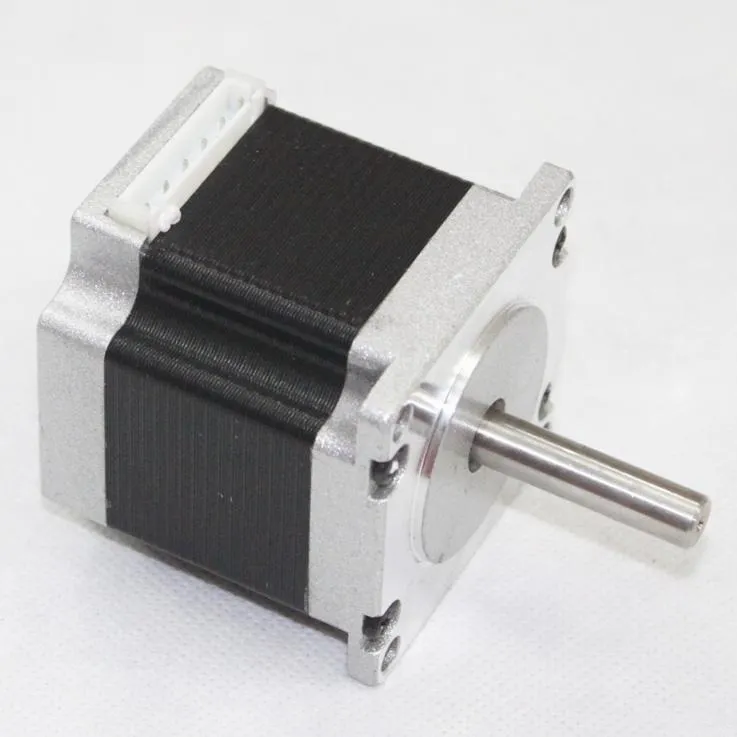

## De que se trata
La iniciativa del proyecto es presentar la realización de un asistente respiratorio de emergencia como una solución alternativa, rápida y económica; ante una posible crisis en el sistema sanitario nacional Argentino.

Por lo que se prenseta esta idea como económica debido a que el dispositivo no supera el valor de los 15000 pesos en la suma de todos sus componentes necesarios; además de que estos son de facil acceso para su compra, a pesar de la cuarentena. Y rápida teniendo en cuenta la fabricacion de sus piezas con impresión 3d sumado a la gran cantidad de gente solidaria en la comunidad de impresion 3d.

Esto se desarrollo luego de estudiar y probar con diferentes sistemas mecánicos con "engranajes impresos" lo que se traduce en mucho ruido y calor; o sistemas de donde se requería mucho torque, al final pude encontrar esta solución realizada por Sebastian Gaggino [Sebastian Gaggino](https://github.com/SebaGaggino/rees31) que usa un sistema de poleas para la distribución de la fuerza ejercida a los laterales del ambu.


<br />
<div align="center">
<iframe width="560" height="315" src="https://www.youtube.com/embed/pcKIJMWP4SA" frameborder="0" allow="accelerometer; autoplay; encrypted-media; gyroscope; picture-in-picture" allowfullscreen></iframe>
</div>
<br />
<br />

## El Modelo utilizado

<div align="center">

</div>
<br />
Como ya mencioné arriba, realice unas pequeñas variaciones al modelo de Sebastian Gaggino
<br />
[Descarga de STLs](repirador31_V5.rar "Descarga del Modelo")

## Esquema de conexiónes

<div align="center">

</div>
<br />
<br />

## Estado del Proyecto

Resumen de desarrollo respecto a las características:<br />
Sistema mecánico para la compresión de un Ambu ------- Listo<br />
Motor de gran torque y funcionamiento continuo -------- Listo<br />
Controlador/Fuente para abastecer el motor -------------- Listo<br />
Electrónica general de sistema ----------------------------- Lista<br />
Interfaces del sistema para setear parámetros ------------- Fase Intermedia<br />
&nbsp;&nbsp;&nbsp;Frecuencia de compresión -------------------------------- Lista<br />
&nbsp;&nbsp;&nbsp;Amplitud de compresión ---------------------------------- a desarrollar<br />
&nbsp;&nbsp;&nbsp;Tiempo de inhalación ------------------------------------ a desarrollar<br />
&nbsp;&nbsp;&nbsp;Tiempo entre inhalación y exhalación -------------------- a desarrollar<br />
&nbsp;&nbsp;&nbsp;Tiempo de exhalación ---------------------------------- a desarrollar<br />
&nbsp;&nbsp;&nbsp;Acción de inhalación y exhalación por demanda --------- a desarrollar<br />
Instalación de sensor de presión diferencial ------------- No empezada<br />

## Codigo
<br />

```markdown
#include  <Wire.h>
#include <LiquidCrystal_I2C.h>
LiquidCrystal_I2C lcd(0x27,20,4); //0x20 o 0x27

 // define pin used
 const int stepPin = 9;
 const int dirPin = 7;
 bool dir = LOW;
 bool stopSignal = false;
 long velPulsoSteper = 0;
 int pasosCont = 0;
 int pasosMax = 5000;
 
 //defino pines encoder
#define outputA 4
#define outputB 3
#define boton 2
  // variables necesarias para encoder
  int counter = 10;
  int aState;
  int aLastState;

 
 void setup() {
 // lcd setup
 lcd.init();      // initialize the lcd 
 lcd.backlight(); // Activar luz de fondo 
 lcd.clear();     // Borrar LCD
 lcd.print("  Respirador V1.0");
 lcd.setCursor(0, 2);
 lcd.print("eliasagustin@gmail.. ");
 //encoder setup
 pinMode (outputA,INPUT);
 pinMode (outputB,INPUT);
 pinMode (boton, INPUT_PULLUP);
  
 // set the two pins as outputs
  pinMode(stepPin,OUTPUT);
  pinMode(dirPin,OUTPUT);
  Serial.begin(9600);
  while(!Serial);
  aLastState = digitalRead(outputA);   //Leemos el valor incial del encoder
  delay(3000);
  
  lcd.setCursor(0, 2);
  lcd.print("Frecuencia:         ");
  lcd.setCursor(12, 2);
  lcd.print(counter);
  lcd.setCursor(0, 3);
  lcd.print("Estado: Apagado");
  velPulsoSteper= map(counter,0,20,150,5000);  // adaptamos el valor leido a un retardo en forma inicial
}
void loop() {
//------------------------------ Lectura Encoder ------------------------------//
//Activamos la puerta serie para sacar las lecturas del contador y leemos la situación de A cuando iniciamos.
aState = digitalRead(outputA);
if (aState != aLastState)
   {
    aLastState = aState; // Guardamos el ultimo valor
      if (digitalRead(outputB) != aState){
            if (counter<20){
              counter ++;
            }
          }else{
            if (counter>0){
              counter --;
            }
          }
      velPulsoSteper= map(counter,0,20,150,5000);  // adaptamos el valor leido a un retardo
      Serial.print("Position: ");
      Serial.println(counter);
      lcd.setCursor(12, 2);
      lcd.print(counter);
      lcd.print(" ");
   }

bool B = digitalRead(boton);
if ( !B )
    { Serial.println("Detiene/Continua");
      if (stopSignal){
        stopSignal = false;
        lcd.setCursor(8, 3);
        lcd.print("Desactivado ");
        delay(200);
      }else{
        stopSignal = true;
        lcd.setCursor(8, 3);
        lcd.print("Activado    ");
        delay(200);
      }
      delay(200);
    }

//--------------------------- Fin Lectura Encoder ----------------------------//

if (stopSignal){
  if (pasosCont<(pasosMax/2)){
    if(dir != LOW){dir=LOW;}
    digitalWrite(dirPin,dir); //Enables the motor to move in a opposite direction
    digitalWrite(stepPin,HIGH);
    delayMicroseconds(velPulsoSteper);
    digitalWrite(stepPin,LOW);
    delayMicroseconds(velPulsoSteper);
    }
  if ((pasosCont>=(pasosMax/2)) and (pasosCont<pasosMax)){
    if(dir != HIGH){dir=HIGH;}
    digitalWrite(dirPin,dir); //Enables the motor to move in a opposite direction
    digitalWrite(stepPin,HIGH);
    delayMicroseconds(velPulsoSteper);
    digitalWrite(stepPin,LOW);
    delayMicroseconds(velPulsoSteper);
    }
  if (pasosCont<pasosMax){
      pasosCont = pasosCont + 1;
    } else {
        pasosCont = 0;
    }
  }
}
```

## Materiales Utilizados
<br />

### Fuente Switching 12v 5a
proximamente 24v 5a para usar otro Motor mas grande que el del video
<br />


### Driver Modular Tb6600 4a Motor Paso A Paso 42v
<br />


### Motor Nema23
proximamente Nema24 de muy Alto Torque
<br />


### Modulo Lm2596 Hvs Step Down In 52v Out 4.5-32v
<br />


### Display Lcd 2004 Backlight Azul 20x4 + Serie I2c
<br />


### Encoder Rotativo Ky-040 - 20 Pasos X Vuelta
<br />


### Switch Final Carrera 
<br />


### Filamento PetG
<br />


### Barra rectificada 8mm
Dos barras de 14.5cm
<br />


### Rodamiento SKF R3zz
2 Rodamientos R3zz que son en pulgadas, la medida interna es de 4.76mm y externa 12.7mm espesor de 4.98mm
<br />


<br />
<div align="center">
<b>Cualquier aporte de modificación en el codigo y/o diseño mecánico es mas que bienvenido.</b> 
<br />
<strong>eliasagustin@gmail.com</strong>
</div>
